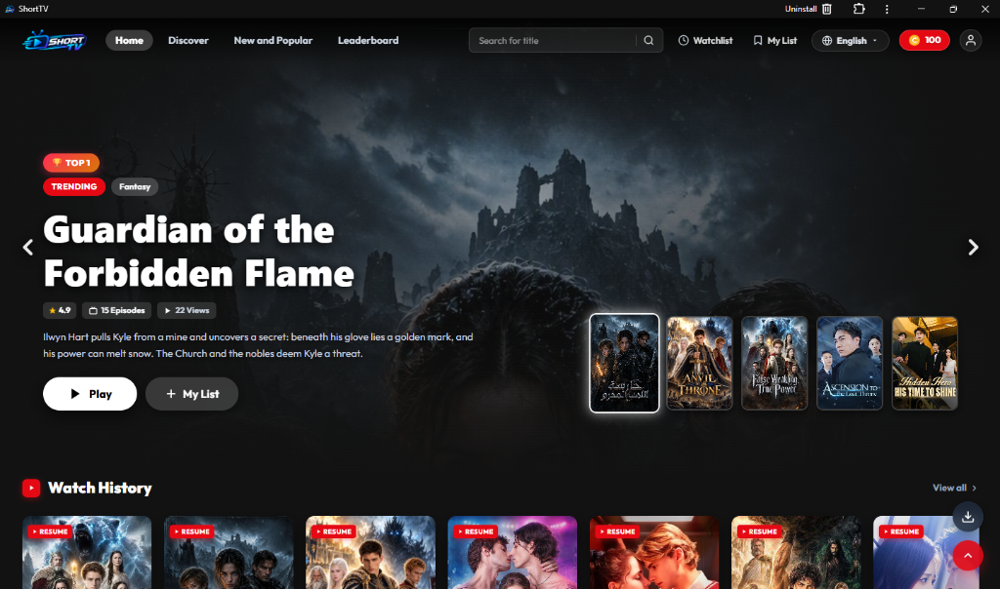
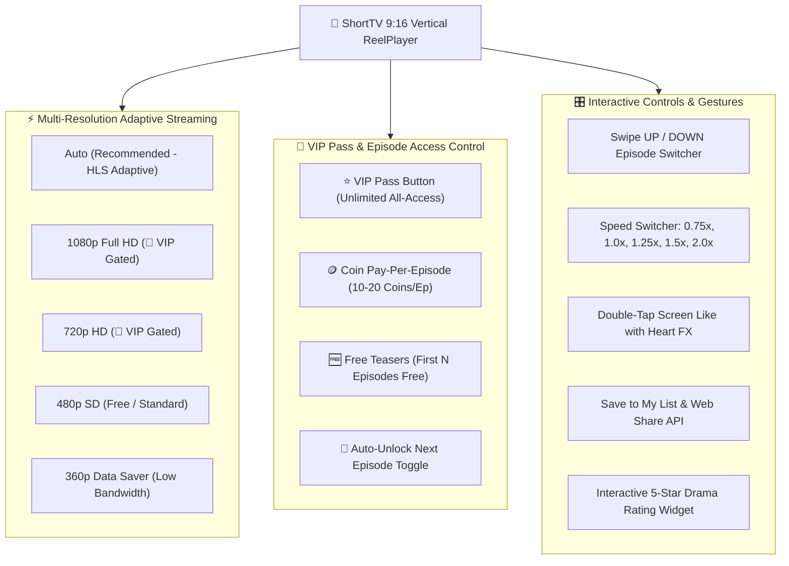
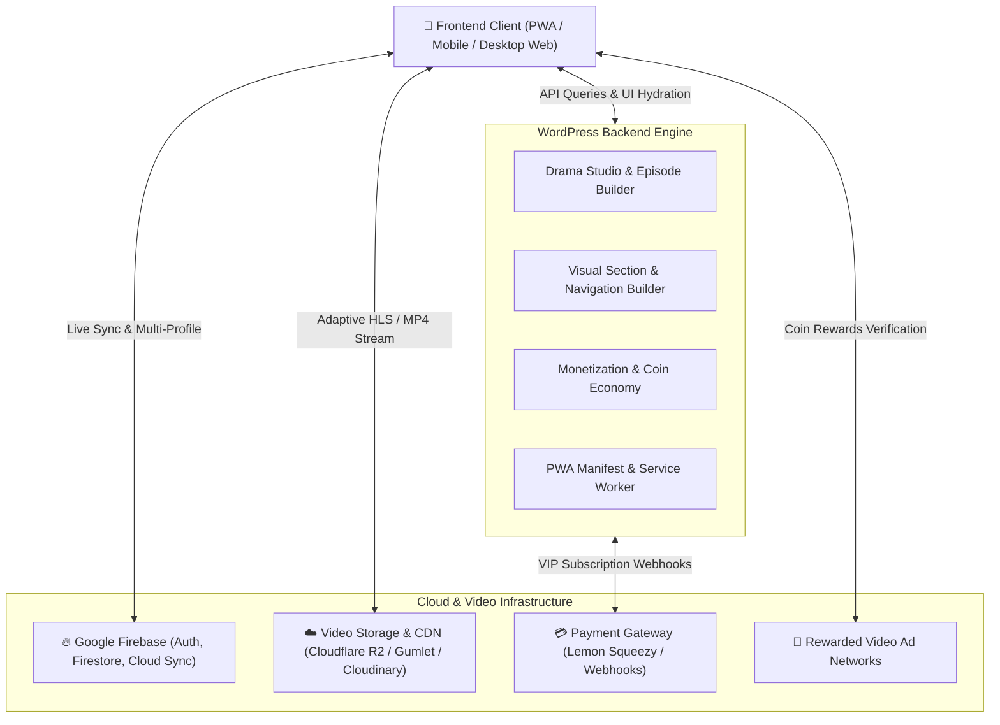

# ShortTV — Short-Drama Streaming Platform for WordPress

  

  
  
  
  
  

  
  

> **ShortTV** is a state-of-the-art, mobile-first **vertical micro-drama streaming platform** engineered specifically for WordPress. Inspired by global industry leaders (*ShortTV, ReelShort, DramaBox, GoodShort*), it is optimized for viral short-drama episodes, bite-sized vertical series, web-novel adaptations, and monetization through coins and VIP subscriptions.

---

## 🎮 Live Interactive Product Demos

Experience the frontend vertical player and backend settings panel live in your browser:

- 📱 **[Launch Live App & Player Demo (https://arielskie.github.io/Short-TV/)](https://arielskie.github.io/Short-TV/)** — Browse mini-series, swipe reels, test double-tap heart animations, 1080p VIP streaming, and coin paywalls.
- ⚙️ **[Launch WordPress Admin Simulator](https://arielskie.github.io/Short-TV/docs/admin-simulator.html)** — Test the real-time Netflix-style splash screen customizer, Cloudflare R2 / Gumlet DRM connection testers, and monetization rules.

---

## 📑 Complete Documentation Suite

| Document | Audience | Highlights |
|---|---|---|
| [**Interactive Admin Simulator**](docs/admin-simulator.html) | Potential Buyers & Clients | **Live browser-based simulation** of the WordPress Admin panel, live Netflix phone splash preview simulator, storage credentials, and monetization dials. |
| [**USER_GUIDE.md**](docs/USER_GUIDE.md) | Viewers & Members | Inside video player, resolution quality tiers (1080p/720p VIP), gesture controls, coin unlocks, and PWA installation. |
| [**ADMIN_GUIDE.md**](docs/ADMIN_GUIDE.md) | Content Managers & Editors | ShortTV Drama Studio, R2 bulk uploader, folder hierarchy routing, and visual section builders. |
| [**CONFIGURATION.md**](docs/CONFIGURATION.md) | System Architects | Firebase Auth & Firestore setup, Cloudflare R2 / Gumlet CDN, payment webhooks. |
| [**INSTALLATION.md**](docs/INSTALLATION.md) | Administrators & Developers | Server requirements, theme/plugin installation, page route mapping. |
| [**FAQ_TROUBLESHOOTING.md**](docs/FAQ_TROUBLESHOOTING.md) | Support & DevOps | CORS fixes, PHP GD configuration, cross-device sync diagnostics. |
| [**CHANGELOG.md**](docs/CHANGELOG.md) | Everyone | Version release history, architectural updates, and feature notes. |
| [**LICENSE.md**](docs/LICENSE.md) | Commercial | Commercial software licensing terms and conditions. |

---

## 🎬 Inside Video: ReelPlayer Features & Monetization

### 1. Video Quality Selector
- **Auto (Recommended)**: Dynamically adjusts HLS video resolution to viewer bandwidth.
- **1080p (Full HD) & 720p (HD)**: High-definition tiers gated behind active **VIP membership** (`👑 VIP` badge). Non-VIP viewers are presented with the VIP Pass upgrade sheet.
- **480p (SD) & 360p (Data Saver)**: Free-access resolutions optimized for mobile data networks.

### 2. VIP Pass & Episode Unlocking
- **⭐ VIP Pass**: Instant unrestricted access to all episodes, 1080p Full HD streaming, zero ads, and VIP badge status.
- **Coin Paywall**: Granular per-episode access rules with optional automatic next-episode unlocking.
- **Visual Status Chips**: Active playing frequency equalizer (`|||`), free episodes, and golden crown VIP badges.

---

## 🏗️ System Architecture

---

## 🌟 Comprehensive Page & Layout Showcase

| Page View | Core Components | Interactive Features |
|---|---|---|
| **🏠 Homepage** | Cinematic Hero Billboard, Genre Quick Pills, Continue Watching Shelf, Curated Carousels | 1-click play, bookmark toggle, live progress bar, floating PWA install & Back-to-Top |
| **🔍 Discover** | Category & Trope Explorer, Dynamic Grid Layout | Filter by release date, popularity, trope tags, with instant hover preview |
| **🎁 Rewards** | 7-Day Check-in Streak, Watch Time Milestones, Video Ads | Progressive daily coin bonuses, red envelope tiered gifts, rewarded video player |
| **🏆 Ranking** | Podium Top 3 & Top 10 Chart, Dynamic Genre Filters | Live heat score engine measuring views, likes, shares, and watch time |
| **👤 Account** | Profile Header, Coins Wallet, SaaS Transaction Ledger | Google One-Tap auth, multi-profile switcher, filterable ledger with deduplication |
| **📱 Watch Player** | Fullscreen 9:16 Vertical Video Feed, Episode Drawer | Quality selector (1080p/720p VIP), swipe UP/DOWN, double-tap like FX, speed toggle (0.75x-2.0x), automated VIP paywall |

---

## ⚡ Core Feature Matrix

| Feature | Description | Benefit |
|---|---|---|
| **ReelPlayer Engine** | Multi-quality vertical streaming with 1080p/720p VIP tiers, prebuffering, and gestures. | Maximize mobile session length and binge-watching. |
| **Cross-Device Sync** | Real-time synchronization via Google Firebase (Firestore & RTDB). | Viewers pick up exactly where they left off on any device. |
| **Dual Monetization** | Pay-per-episode coins + recurring VIP memberships. | Flexible revenue channels maximizing viewer conversions. |
| **Gamification Engine** | Daily login streaks, watch time milestones (red envelopes), and rewarded video ads. | 3x user retention and ad revenue generation. |
| **PWA App Experience** | Native-like desktop and mobile app with custom dynamic icons. | Zero app-store fees, high install rates, and offline shell. |
| **Multi-Profile System** | Up to 5 independent sub-profiles per user account. | Shared household accounts with personal history tracking. |
| **Ledger Guards** | Real-time deduplication filters preventing double-reward exploits. | Guaranteed financial data integrity and analytics accuracy. |

---

## 🛠️ Admin Builder & Studio Capabilities

| Admin Studio | Key Capabilities |
|---|---|
| **🎬 ShortTV Drama Studio** | Dedicated studio for vertical series, multi-cloud storage selector (Cloudflare R2, Gumlet, Cloudinary), auto-subfolder routing, batch R2 uploader, and auto-sort by episode number. |
| **📱 Episode Stream Pipeline** | 1-click batch paywall rules (*First 5 Free, next Coins* $\rightarrow$ *Apply to All*), sequential auto-renumbering (1 to N), and format switcher (Direct MP4 / Adaptive HLS). |
| **🏠 Visual Section Builder** | Desktop & mobile homepage rail manager with drag-and-drop reordering, layout styles (Hero Billboard, Vertical 9:16 Poster, Square Tile), and content source filters. |
| **📱 Mobile Header Studio** | Live interactive smartphone preview with 1-click toggles (Logo, Search, Coins, My List, History, Genre line) and auto-synced WordPress genre taxonomies. |
| **💳 Monetization Manager** | Configurable coin packages, bonus coin tiers, VIP subscriptions (Weekly/Monthly/Yearly), and webhook payment gateways. |

---

## 🚀 Quick Start in 4 Steps

1. **Upload Theme & Core Plugin to WordPress**:
   - `short-stream-core.zip` $\rightarrow$ **Plugins → Add New**
   - `short-stream.zip` $\rightarrow$ **Appearance → Themes**
2. **Configure Permalinks**:
   - Navigate to **Settings → Permalinks** and choose **Post name**.
3. **Enter Firebase & Video CDN Credentials**:
   - Open **ShortTV Settings** and paste your Firebase Web App and Cloudflare R2 / CDN keys.
4. **Upload Brand Site Icon**:
   - Go to **Appearance → Customize → Site Identity → Site Icon** to automatically generate all PWA and favicon assets.

---

## 📄 License
ShortTV is proprietary software released under the commercial theme license. All rights reserved.
