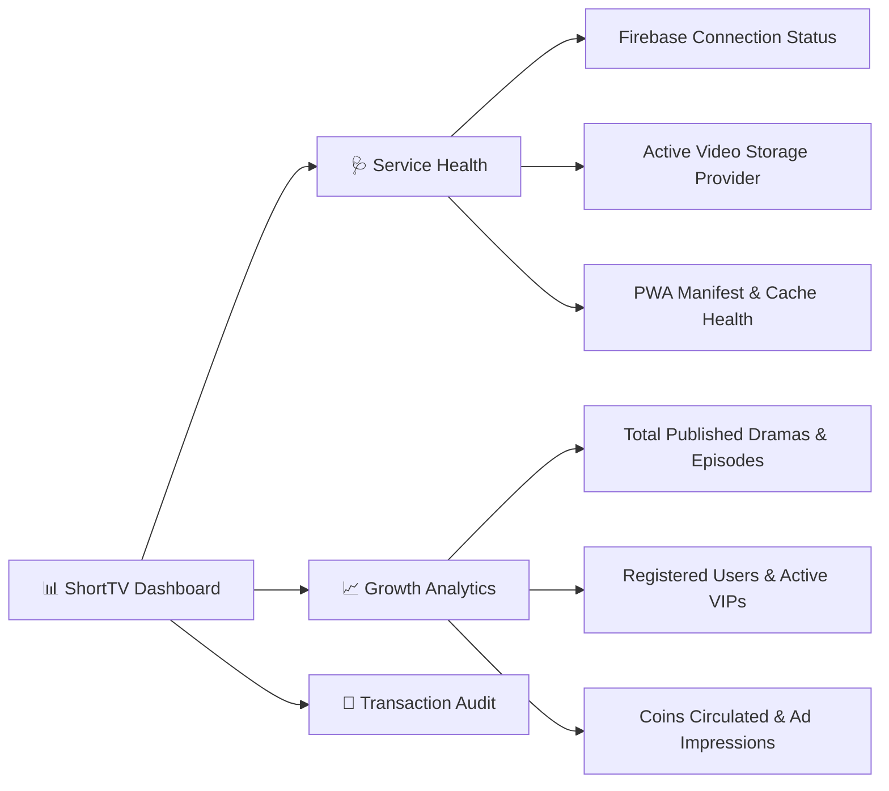
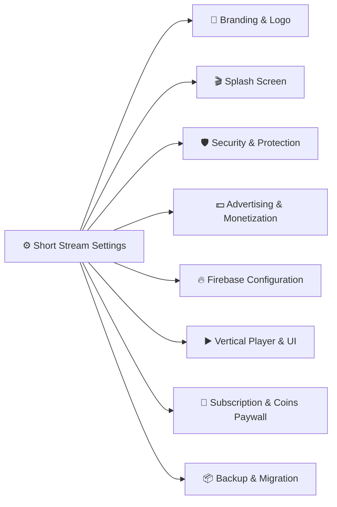
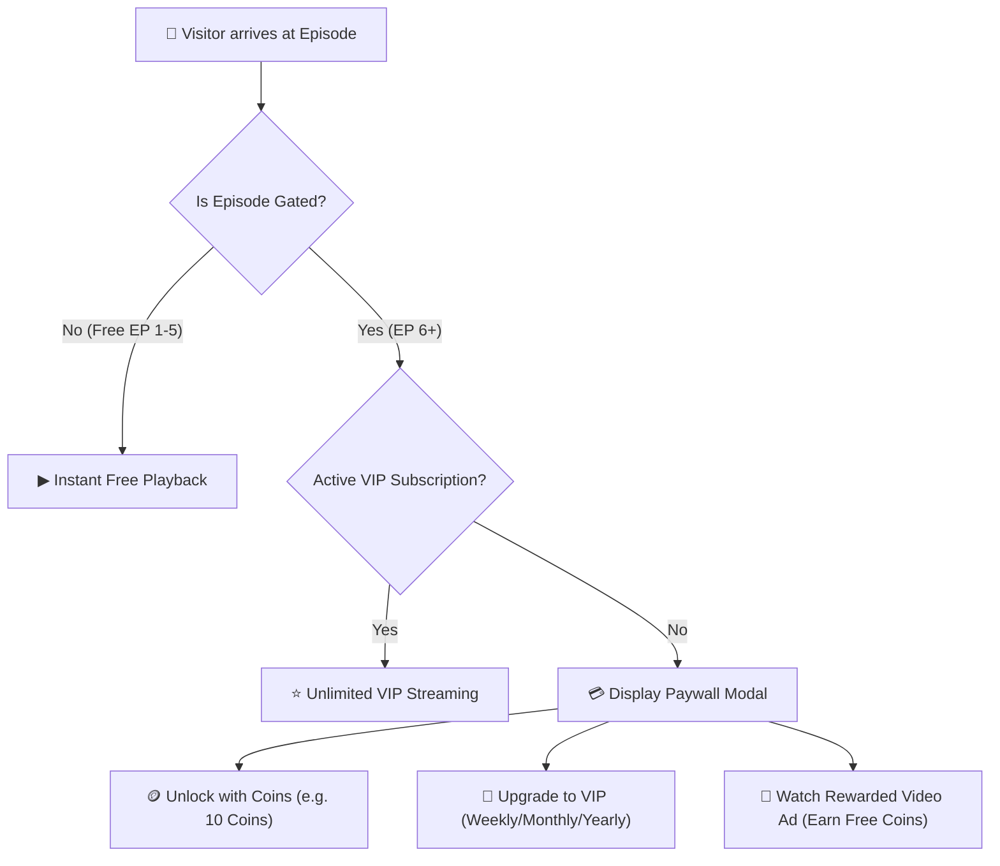

# ShortTV — Administrator & Content Publishing Guide

This guide provides complete operational documentation for managing drama series, bulk uploading episodes, configuring paywalls, setting up ad networks, broadcasting notifications, and customizing your platform.

---

## 📋 Table of Contents

1. [Admin Architecture & Dashboard](#1-admin-architecture--dashboard)
2. [ShortTV Drama Studio & Episode Builder](#2-shorttv-drama-studio--episode-builder)
3. [Short Stream Global Settings (Control Center)](#3-short-stream-global-settings-control-center)
4. [Paywall & Coin Economy Management](#4-paywall--coin-economy-management)
5. [Ad Network & Reward Configuration](#5-ad-network--reward-configuration)
6. [Visual Homepage & Navigation Section Builder](#6-visual-homepage--navigation-section-builder)
7. [Video Storage & Streaming Delivery](#7-video-storage--streaming-delivery)
8. [Site Identity & PWA Customization](#8-site-identity--pwa-customization)
9. [Notification & Announcement Broadcasting](#9-notification--announcement-broadcasting)
10. [Pre-Launch & Security Checklist](#10-pre-launch--security-checklist)

---

## 1. Admin Architecture & Dashboard

Navigate to **WordPress Admin → ShortTV → Dashboard** to inspect system health:

---

## 2. ShortTV Drama Studio & Episode Builder

The **ShortTV Drama Studio** is a purpose-built workspace engineered for fast publishing of episodic vertical reels:

### Studio Controls & Layout Overview

| Studio Section | Component Controls | Purpose & Action |
|---|---|---|
| **Top Action Bar** | `Draft Mode` / `Published`, `ID #315`, `View Live Watch Page`, `Save Draft`, `Publish Drama` | Immediate preview, draft saving, and 1-click publishing. |
| **Storage & R2 Manager** | `Storage Provider` (Cloudflare R2, Gumlet, Cloudinary), `Folder: short`, `+ New Folder`, `Auto Subfolder: short/Title` | Automated cloud bucket directory routing and multi-CDN management. |
| **Bulk Batch Tools** | `Bulk Upload Videos (R2)`, `Auto-Sort by Ep #` | Drag-and-drop batch video uploads and automated numerical file sorting. |
| **Poster Key-Art** | 9:16 Vertical Poster drop zone, Image URL, Media library picker | Upload vertical art (`720x1280` or `1080x1920` px) for cards and players. |
| **Drama Metadata** | Drama Title, Storyline Synopsis / Overview, Genres, Language, Year, Total Episodes | Set drama tropes and synopsis displayed in the player info drawer. |
| **Episode Stream Pipeline** | `Rule: First 5 Free, next Coins` $\rightarrow$ `Apply to All`, `Auto-Renumber (1 to N)`, `Convert MP4 to HLS`, `Use Direct MP4` | Batch paywall configuration and sequential episode re-indexing. |

---

### Step-by-Step Publishing Workflow

1. **Storage Setup**:
   - Select **Cloudflare R2** (or Gumlet / Cloudinary).
   - Keep `Auto Subfolder` checked so uploads are neatly filed under `short / [Drama Title] /`.
2. **Bulk Video Upload**:
   - Click **Bulk Upload Videos (R2)** and drop all episode video clips (`ep1.mp4`, `ep2.mp4`, etc.).
   - Click **Auto-Sort by Ep #** to automatically arrange them in chronological order.
3. **Configure Paywall Rules**:
   - Select `First 5 Free, next Coins` from the quick rules dropdown.
   - Click **Apply to All** to instantly lock episode 6+ behind coin/VIP access.
4. **Fill Metadata & Poster**:
   - Enter title, synopsis, and comma-separated genres (*Billionaire, Romance, Revenge*).
   - Upload the 9:16 vertical poster image.
5. **Publish**:
   - Click **Publish Drama** in the top right to make the series live immediately.

---

## 3. Short Stream Global Settings (Control Center)

Navigate to **WordPress Admin → ShortTV / Short Stream → Settings**:

The Settings center features **8 dedicated configuration tabs**:

| Tab | Feature / Controls | Purpose & Configuration |
|---|---|---|
| 🎨 **Branding & Logo** | Custom Logo Upload, Display Mode (`Image Only` vs `Image Icon + Text`), Desktop & Mobile Dimensions | Set header logos, custom heights (e.g. 42px desktop, 36px mobile), and brand names. |
| 🎬 **Splash Screen** | Launch animation mode (`Netflix-Style Monogram Ribbon`, `Custom Logo`, `Minimalist Typography`), Backgrounds, Glow Accents | Opening cinematic app launch screen with session frequency controls. |
| 🛡️ **Security & Protection** | DevTools Blocker, Right-Click / Inspect Element Protection, AdBlock Detector, Frame embedding restrictions | Protect video source URLs and DRM streams from browser inspection and scrapers. |
| 💵 **Advertising & Monetization** | Rewarded Video Ad Units (AdMob, AdSense, Adsterra), Coins per Ad View, Interstitial intervals | Monetize non-paying viewers with video ads that reward coins upon completion. |
| 🔥 **Firebase Configuration** | API Key, Project ID, Auth Domain, Storage Bucket, Realtime sync switch | Connects Firebase for 1-click Google Sign-in, cross-device watch history, and user wallets. |
| ▶️ **Vertical Player & UI** | Autoplay next episode, Double-tap to like, Swipe gestures, Watermark placement, Video preload buffer | Customize the TikTok / Reel style vertical streaming player UX. |
| 💎 **Subscription & Coins Paywall** | Default unlock cost per episode, Coin Packages (Tiers 1–3), VIP Plans (Weekly/Monthly/Yearly) | Configure the dual-economy coin purchasing rates and all-access VIP tiers. |
| 📦 **Backup & Migration** | 1-Click Full JSON Export, 1-Click Schema Import, Drama Library Exporter | Export/import all platform settings, carousels, endpoints, and drama content in seconds. |

---

## 4. Paywall & Coin Economy Management

ShortTV implements a high-converting **Dual-Monetization Model**:

### Coin Bundle Configuration
Under **ShortTV → Settings → Subscription & Coins Paywall**:
- **Default Episode Unlock Cost**: e.g., `10 Coins` per episode.
- **Coin Packages**:
  - `Tier 1`: 100 Coins = \$0.99
  - `Tier 2`: 500 Coins + 50 Bonus = \$4.99 *(Popular)*
  - `Tier 3`: 1,200 Coins + 200 Bonus = \$9.99 *(Best Value)*
- **VIP Subscription Plans**:
  - **Weekly Pass**: \$2.99 / week
  - **Monthly VIP**: \$9.99 / month
  - **Annual All-Access**: \$79.99 / year

---

## 5. Ad Network & Reward Configuration

Under **ShortTV → Settings → Advertising & Monetization**:
- **Rewarded Video Ad Units**: Enter your Google AdSense / AdMob / Adsterra unit IDs.
- **Reward Payout**: Set coins granted per completed 30s ad view (e.g. `+10 Coins`).
- **Fraud Prevention & Deduplication**: ShortTV includes server-side and client-side deduplication guards that prevent users from double-claiming rewards from a single ad session.

---

## 6. Visual Homepage & Navigation Section Builder

ShortTV features a powerful, real-time **Visual Section & Navigation Studio** divided into 3 dedicated engines:

### A. 💻 Desktop Section Builder (`Desktop Header`)
Manage which content rails appear on the desktop streaming homepage and sub-pages:

| Column | Description | Example Values |
|---|---|---|
| **Section Title** | Heading displayed above the carousel rail | `Hero Slider`, `Watch History`, `Most Popular`, `Short VIP 👑` |
| **Card Layout Style** | Presentation format of video cards | `Hero Slider (Cinematic Billboard)`, `Vertical 9:16 Poster`, `Square Tile` |
| **Content Source** | Dynamic query filter | `Latest Posts`, `Continue Watching (User History)`, `Most Popular`, `VIP Exclusives` |
| **Max Items** | Maximum dramas displayed in the rail | `5`, `10`, `15`, `20` |
| **Actions** | Drag-and-drop or 1-click reorder | `^` (Move Up), `v` (Move Down), `x` (Remove) |

---

### B. 📱 Mobile Header & Navigation Studio
Features a **Live Smartphone Preview** with real-time toggle switches and genre taxonomy management:

- **Live Interactive Screen View**: Shows the exact pixel-perfect view of your mobile top bar as you make changes with auto-save active.
- **Instant Toggles**: Enable or disable elements (*Brand Logo, Search, Language, Coins Wallet, My List, History, Genre Line*) with 1-click checkboxes.
- **Dynamic Genre Sync**: Automatically pulls categories assigned to your drama posts (*Billionaire, Throne, Superpower, Big Shot, CEO, Modern, Romance, Fantasy*) with a 1-click **+ Add / Edit Genres** link.

---

### C. 📱 Mobile Home Section Builder (`Mobile Bottom Menu`)
- **Bottom Navigation Config**: Manage and reorder the 5 primary mobile destinations (*Home, Discover, Rewards, Leaderboard, Account*).
- **Mobile-Specific Carousels**: Customize distinct content rails specifically tuned for handheld screens (e.g. compact 3-card grid).

---

## 7. Video Storage & Streaming Delivery

Navigate to **ShortTV → Video Storage & CDN**:

| Provider | Best For | Configuration Steps |
|---|---|---|
| ☁️ **Cloudinary Settings** | Direct browser uploads & automatic optimization | Enter Cloud Name, Unsigned Upload Preset, and Default Asset Folder. |
| 🎬 **Gumlet Video CDN** | DRM token protection & adaptive HLS transcoding | Enter Gumlet Collection ID & API Token for secure token signing. |
| 📦 **Cloudflare R2 Storage** | Zero egress fees & S3-compatible cloud storage | Enter Account ID, Access Key, Secret Key, and Public Custom Domain. |

---

## 8. Site Identity & PWA Customization

1. Go to **Appearance → Customize → Site Identity**.
2. Upload your square brand icon (minimum `512x512` px) in **Site Icon**.
3. ShortTV automatically handles:
   - Web App Manifest generation (`manifest.json`).
   - Standard `192x192` and `512x512` PNG asset creation.
   - Apple Touch Icons for iOS home screen shortcuts.
   - Dynamic cache busting (`?v=...`) to ensure updates appear immediately on mobile devices.

---

## 9. Notification & Announcement Broadcasting

Navigate to **ShortTV → Notifications**:
- Send platform-wide push banners for new drama releases.
- Broadcast limited-time coin discount promotions.
- Unread alerts trigger badge indicators on the user's notification bell icon.

---

## 10. Pre-Launch & Security Checklist

- [ ] **Permalinks**: Verified set to `Post name` in **Settings → Permalinks**.
- [ ] **HTTPS / SSL**: Verified active and valid certificate across all subdomains.
- [ ] **Firebase Authentication**: Authorized domain added in Firebase Console.
- [ ] **Firestore Security Rules**: Published production security rules.
- [ ] **CORS Headers**: Added `Access-Control-Allow-Origin: *` to video CDN bucket.
- [ ] **PHP GD Extension**: Enabled `extension=gd` in `php.ini`.
- [ ] **Required Pages**: Created `/watch`, `/account`, `/reward`, `/leaderboard`, `/genre`, `/my-list`, `/subscription`.
- [ ] **Payment Webhook**: Tested Lemon Squeezy / Stripe test purchase with instant VIP activation.
