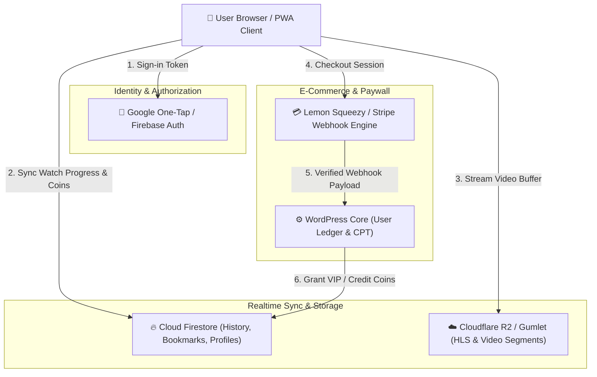
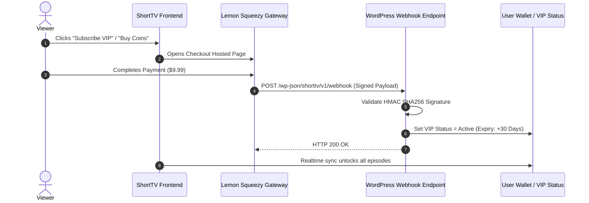

# ShortTV — Technical Configuration & Integration Guide

This guide details the technical setup for Google Firebase, Video CDN storage, Paywall Webhooks, Multi-Profile Cloud Architecture, and Progressive Web App (PWA) services.

---

## 📋 Table of Contents

1. [System Integration Topology](#1-system-integration-topology)
2. [Google Firebase Setup (Auth, Firestore & RTDB)](#2-google-firebase-setup-auth-firestore--rtdb)
3. [Video Storage & CDN Configuration](#3-video-storage--cdn-configuration)
4. [Paywall, VIP Subscriptions & Webhook Integration](#4-paywall-vip-subscriptions--webhook-integration)
5. [Multi-Profile Cloud Storage Schema](#5-multi-profile-cloud-storage-schema)
6. [Progressive Web App (PWA) Engine](#6-progressive-web-app-pwa-engine)

---

## 1. System Integration Topology



---

## 2. Google Firebase Setup (Auth, Firestore & RTDB)

Firebase powers real-time user authentication and cross-device synchronization for **Watch History**, **Continue Watching**, **Bookmarks (My List)**, and **Multi-Profile Data**.

### Step 1: Create Firebase Project
1. Open the [Firebase Console](https://console.firebase.google.com/) and click **Add Project**.
2. Name your project (e.g., `shorttv-production`) and complete the creation wizard.

### Step 2: Enable Authentication Providers
1. In the left sidebar, navigate to **Build → Authentication → Sign-in method**.
2. Enable **Email/Password**.
3. Enable **Google** sign-in (enter your Project support email and save).
4. Go to **Authentication → Settings → Authorized domains** and add:
   - Your live production domain (e.g. `shorttv.app`)
   - Your staging / localhost domain (e.g. `localhost`)

### Step 3: Configure Cloud Firestore Security Rules
Go to **Firestore Database → Rules**, paste the following security rules, and click **Publish**:

```javascript
rules_version = '2';
service cloud.firestore {
  match /databases/{database}/documents {
    
    // User root document & sub-collections
    match /users/{userId} {
      allow read, write: if request.auth != null && request.auth.uid == userId;
      
      // Multi-profile watch progress
      match /continue_watching/{docId} {
        allow read, write: if request.auth != null && request.auth.uid == userId;
      }
      
      // Watch history log
      match /history/{docId} {
        allow read, write: if request.auth != null && request.auth.uid == userId;
      }
      
      // Personal bookmarks & watchlist
      match /my_list/{docId} {
        allow read, write: if request.auth != null && request.auth.uid == userId;
      }
      
      // Coin balance & transaction ledger
      match /wallet/{docId} {
        allow read: if request.auth != null && request.auth.uid == userId;
        allow write: if request.auth != null && request.auth.uid == userId;
      }
    }
  }
}
```

### Step 4: Inject Credentials into WordPress
Copy your Web App credentials from **Project Settings → General → Your apps (`</>`)** and paste them into **WordPress Admin → ShortTV Settings → Firebase**:

```json
{
  "apiKey": "AIzaSy...",
  "authDomain": "shorttv-production.firebaseapp.com",
  "projectId": "shorttv-production",
  "storageBucket": "shorttv-production.appspot.com",
  "messagingSenderId": "1234567890",
  "appId": "1:1234567890:web:abcdef"
}
```

---

## 3. Video Storage & CDN Configuration

### Cloudflare R2 S3 Setup (Recommended: Zero Egress)
1. In Cloudflare Dashboard, go to **R2 → Create Bucket** (e.g., `shorttv-episodes`).
2. Go to **R2 → Manage R2 API Tokens → Create API Token** with `Object Read & Write` permissions.
3. Configure bucket **CORS Policy** under Settings:

```json
[
  {
    "AllowedOrigins": ["*"],
    "AllowedMethods": ["GET", "HEAD"],
    "AllowedHeaders": ["*"],
    "MaxAgeSeconds": 86400
  }
]
```

4. Connect your Custom Domain (e.g. `cdn.shorttv.app`) in the bucket settings.

---

## 4. Paywall, VIP Subscriptions & Webhook Integration



---

## 5. Multi-Profile Cloud Storage Schema

ShortTV supports up to 5 individual sub-profiles per user account. All watch timestamps and resume positions are segmented by profile key:

```
Firestore: /users/{userId}/continue_watching/{dramaId}
{
  "drama_id": 304,
  "drama_title": "Guardian of the Forbidden Flame",
  "episode": 3,
  "progress_pct": 68,
  "timestamp": 142.5,
  "profile_id": "profile_1",
  "updated_at": 1791338000000
}
```

---

## 6. Progressive Web App (PWA) Engine

ShortTV ships with native PWA endpoints that automatically serve:
- **`/?short-manifest=1`**: Dynamic `manifest.json` with site title, orientation locks, standalone display mode, and custom icons.
- **`/?short-sw=1`**: Service worker script enabling background caching and offline shell loading.
- **Automatic Cache-Busting**: Generates version query strings matching the WordPress site icon ID (`?v=313`) to prevent stale app metadata in client browsers.
