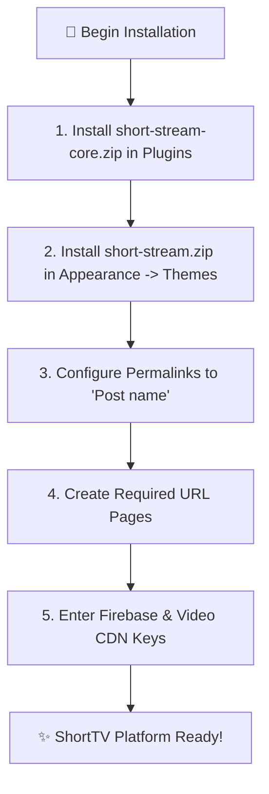

# ShortTV — Installation & Server Setup Guide

This guide walks administrators and developers through installing and configuring the **ShortTV** theme and **ShortTV Core** plugin on WordPress.

---

## 💻 Server & Environment Requirements

| Requirement | Minimum Specification | Recommended Specification |
|---|---|---|
| **WordPress** | 6.0+ | 6.4+ |
| **PHP** | 8.1+ | 8.2+ |
| **PHP Extensions** | `curl`, `json`, `mbstring`, `openssl`, `zip`, `gd` | `gd` or `imagick` active |
| **Database** | MySQL 5.7+ / MariaDB 10.3+ | MySQL 8.0+ / MariaDB 10.6+ |
| **Web Server** | Apache with `mod_rewrite` / Nginx | Nginx + PHP-FPM |
| **SSL / HTTPS** | **Required** | Valid SSL (Required for PWA & Firebase Auth) |
| **Permalinks** | Post name (`/%postname%/`) | Post name |

---

## 📦 Package Distribution Structure

```
shorttv-package/
├── short-stream.zip          # Active WordPress Theme
├── short-stream-core.zip     # Core Plugin Engine (Required)
└── docs/                     # Complete Platform Documentation
```

---

## 🚀 Step-by-Step Installation Flowchart



---

## 🛠️ Step-by-Step Instructions

### Step 1: Install & Activate the Core Plugin
1. In your WordPress Admin Dashboard, navigate to **Plugins → Add New → Upload Plugin**.
2. Select `short-stream-core.zip` from your computer and click **Install Now**.
3. Click **Activate Plugin**.
4. You will see a new **ShortTV** admin suite appear in your sidebar.

### Step 2: Install & Activate the Theme
1. Go to **Appearance → Themes → Add New → Upload Theme**.
2. Select `short-stream.zip` and click **Install Now**.
3. Click **Activate**.

### Step 3: Configure Permalinks
1. Go to **Settings → Permalinks**.
2. Under **Common Settings**, select **Post name** (`/%postname%/`).
3. Click **Save Changes** (this registers all custom taxonomy and player routes).

### Step 4: Create Required Platform Pages
Navigate to **Pages → Add New** and create pages with the exact slugs below:

| Page Title | Required URL Slug | Template / Purpose |
|---|---|---|
| **Watch** | `watch` | Fullscreen Vertical Player Feed |
| **Auth** | `auth` | Google One-Tap & Sign-in |
| **Account** | `account` | User Profile, Wallet & Multi-Profiles |
| **History** | `history` | Watch Progress & Continue Watching |
| **My List** | `my-list` | Private Bookmarks & Watchlist |
| **Discover** | `genre` | Category & Trope Hub |
| **Search** | `search` | Instant Debounced Search |
| **Rewards** | `reward` | Daily Streak, Watch Time Milestones & Video Ads |
| **Leaderboard** | `leaderboard` | Top 10 Ranking & Heat Score Charts |
| **Subscription**| `subscription` | VIP Membership Paywall Checkout |

---

## 🔄 Upgrading Existing Installations

1. Backup your WordPress database and `wp-content/uploads/` directory.
2. In **Plugins → Add New → Upload Plugin**, upload the latest `short-stream-core.zip` and click **Replace current with uploaded**.
3. In **Appearance → Themes → Add New → Upload Theme**, upload the latest `short-stream.zip` and click **Replace current with uploaded**.
4. Go to **Settings → Permalinks** and click **Save Changes**.
