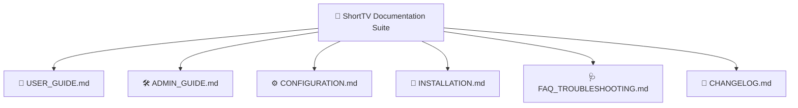

# ShortTV — Complete Platform Documentation Suite

Welcome to the **ShortTV Documentation Suite**. This directory provides architectural specifications, user guides, administrative procedures, and configuration references.

  
  

---

## 📚 Table of Documents

| Document | Focus Area | Key Highlights |
|---|---|---|
| [**Interactive Admin Simulator**](admin-simulator.html) | Live Feature Demo | **Browser-based live simulation** of the WordPress Admin dashboard, live smartphone splash simulator, CDN manager, and paywall rules. |
| [**USER_GUIDE.md**](USER_GUIDE.md) | Viewers & Mobile Users | **Inside Video Experience**, Video Quality Selector (1080p/720p VIP), Gesture Navigation, VIP Pass, Coin Unlocking, Rating Widget, Comments, and PWA Installation. |
| [**ADMIN_GUIDE.md**](ADMIN_GUIDE.md) | Content Managers | ShortTV Drama Studio, R2/Gumlet/Cloudinary Folder Routing, Paywall Rules (`First 5 Free`), Section Builder, Notifications broadcasting. |
| [**CONFIGURATION.md**](CONFIGURATION.md) | System Architects | Firebase Auth & Firestore, Cloudflare R2 / Gumlet API credentials, Payment Gateway webhooks (Lemon Squeezy). |
| [**INSTALLATION.md**](INSTALLATION.md) | System Admins | WordPress 6.0+ setup, PHP 8.1+ extensions, core plugin & theme activation, permalinks structure. |
| [**FAQ_TROUBLESHOOTING.md**](FAQ_TROUBLESHOOTING.md) | DevOps & Support | CORS resolution, video prebuffering optimization, Firebase security rules, duplicate ledger prevention. |
| [**CHANGELOG.md**](CHANGELOG.md) | Release Notes | Version milestones, new features, bug fixes, and security patches. |

---

## 🎬 Inside Video Player Highlights

- **Multi-Bitrate Quality Selector**: Auto (HLS Adaptive), 1080p Full HD (`👑 VIP`), 720p HD (`👑 VIP`), 480p SD, and 360p Data Saver.
- **VIP Pass Instant Unlocking**: Instant unlimited streaming across all episodes with 1080p clarity and ad-free viewing.
- **Episode Unlocking System**: Free teaser episodes, coin-based unlocks with auto-unlocking toggle, and VIP pass integration.
- **Mobile Gesture Suite**: Swipe UP/DOWN for next/previous episode, double-tap to like with heart animation, speed control (0.75x to 2.0x), volume HUD, and fullscreen mode.
- **Interactive Engagement Drawer**: Episode selection grid with playing equalizer indicator (`|||`), 5-star rating widget, expandable synopsis, and real-time comments.
