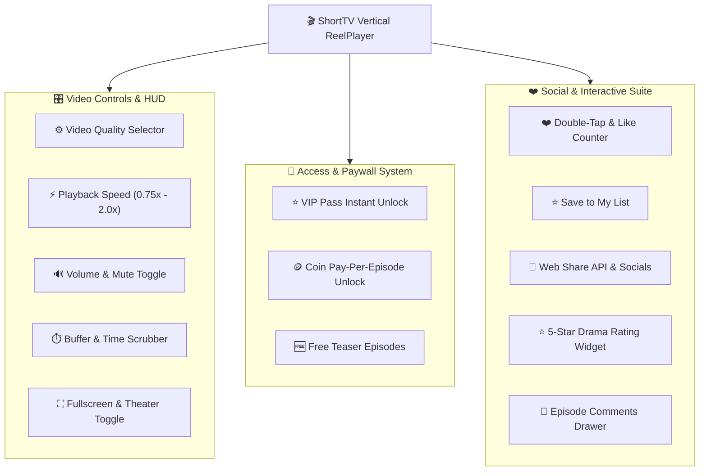
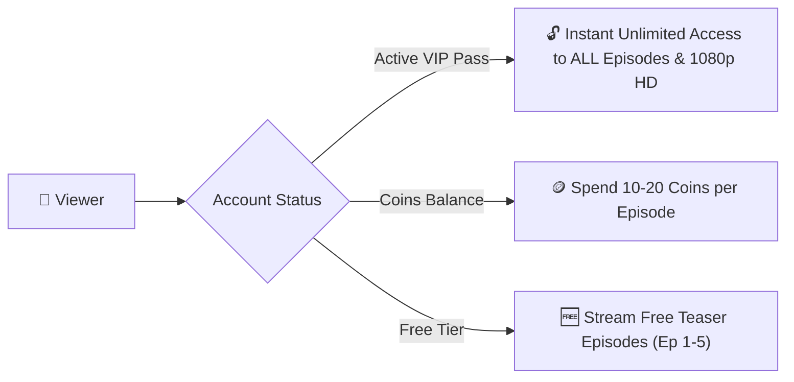
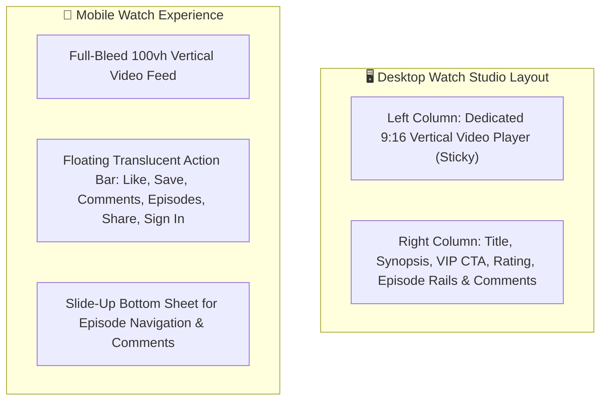
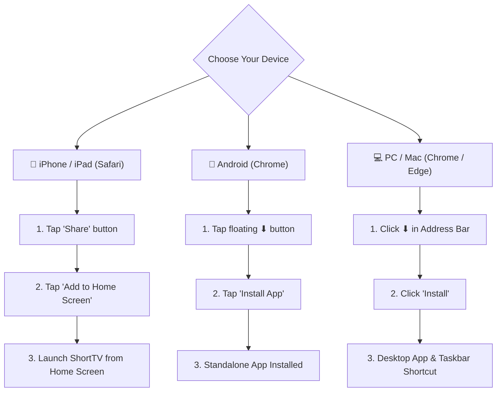

# ShortTV — Viewer & Inside Video Player Experience Guide

Welcome to **ShortTV**! This guide provides an exhaustive walkthrough of everything inside the vertical video player, including quality selection, VIP streaming privileges, episode unlocking, gesture navigation, engagement tools, and account syncing.

---

## 📱 Inside Video: The ShortTV ReelPlayer Engine

The ShortTV ReelPlayer is a mobile-first, ultra-responsive 9:16 vertical streaming player designed to replicate the seamless, binge-worthy experience of TikTok, ReelShort, DramaBox, and ShortTV.

---

## ⚙️ Video Quality Selector (HD, SD & VIP Tiers)

When viewers click or tap the **Auto / Quality** button on the player control bar, an intuitive resolution selection popup appears:

| Resolution Tier | Badge Label | Access Level | Description & Optimal Bandwidth |
|---|---|---|---|
| **Auto** | `Recommended` | **Free / All Users** | Adaptive HLS streaming (ABR) that dynamically adjusts bitrate to match network speed without buffering. |
| **1080p** (Full HD) | `👑 VIP` | **VIP Members Only** | Pristine 1080x1920 Full HD vertical clarity for crystal-clear visuals on high-resolution displays. |
| **720p** (HD) | `👑 VIP` | **VIP Members Only** | High-definition 720x1280 stream offering sharp details with optimal performance. |
| **480p** (SD) | `SD` | **Free / All Users** | Standard Definition suitable for everyday streaming on mobile data. |
| **360p** (Data Saver) | `Data Saver` | **Free / All Users** | Low-bandwidth mode designed for unstable mobile connections and minimizing data usage. |

### 🔒 VIP Quality Gating Behavior
- Non-VIP viewers selecting **1080p** or **720p** will trigger the **VIP Pass Subscription Modal**, highlighting the perks of Full HD streaming.
- Active VIP members enjoy instant 1-click switching to 1080p/720p without interruption.

---

## 👑 VIP Pass & Monetization Explained

### 1. The VIP Pass (`⭐ VIP Pass` Button)
The prominent golden **VIP Pass** button in the header and watch player unlocks:
- **Unlimited Binge-Watching**: Instant access to all locked episodes across every drama on the platform.
- **Full HD 1080p & 720p Streaming**: Direct access to highest-bitrate video streams.
- **Zero Ad Interruptions**: Bypass all sponsored video ads.
- **VIP Golden Crown Badge**: Displayed on profile avatar and comment threads.

### 2. Coin Pay-Per-Episode System
- Viewers without an active VIP Pass can unlock individual episodes using **Coins** stored in their wallet.
- Typical pricing: **10 to 20 Coins per episode**.
- **Auto-Unlock Toggle**: Viewers can check *"Auto-unlock next episode"* for seamless continuous streaming while binging.

### 3. Episode Unlocking Rules & Badges
On the episode selector bar / drawer:
- **Active Episode (`1`, `2`, ...)**: Highlighted with purple accent and live audio equalizer frequency bars (`|||`).
- **Unlocked / Free Episode**: Plain number chip with instant playback.
- **Coin-Locked Episode (`🪙 / 👑`)**: Displays a golden crown or lock icon indicating coin unlock or VIP pass requirement.

---

## 🎛️ Player Controls, Gestures & Shortcuts

### Complete Gesture & Shortcut Reference

| User Action | Mobile Touch Gesture | Desktop Keyboard Shortcut | Player Response |
|---|---|---|---|
| **Next Episode** | **Swipe UP** | `Arrow Down` or `J` | Smooth vertical glide transition to next chapter |
| **Previous Episode** | **Swipe DOWN** | `Arrow Up` or `K` | Returns to previous chapter |
| **Play / Pause** | Single Tap center screen | `Spacebar` | Immediate play/pause toggle with central ripple pulse |
| **Like Drama** | **Double Tap** center screen | `L` | Floating heart particle explosion animation + counter increment |
| **Seek Forward / Back** | Drag progress slider | `Arrow Left` / `Arrow Right` | Live seek bar preview with precise timestamp jumping |
| **Mute / Unmute** | Tap speaker icon | `M` | Volume HUD toggle with remembered audio level |
| **Fullscreen Mode** | Tap expand icon | `F` | Native fullscreen expansion |
| **Episode Drawer** | Tap **Episodes** button | `E` | Slide-up bottom-sheet episode selector |
| **Playback Speed** | Tap **1.0x** pill | `S` | Cycles `0.75x` $\rightarrow$ `1.0x` $\rightarrow$ `1.25x` $\rightarrow$ `1.5x` $\rightarrow$ `2.0x` |
| **Quality Menu** | Tap **Auto ⏷** pill | `Q` | Opens resolution selector popup |

---

## 💬 Social, Ratings & Interactive Suite

### 1. Double-Tap Like & Like Counter
- Double-tapping anywhere on the playing video spawns vibrant floating heart particles.
- Increments the public like counter and syncs to your personal profile favorites.

### 2. Save to My List (`⭐ Save to List`)
- 1-click bookmarking that saves the drama to your personal **My List** shelf on the homepage and account hub.

### 3. Social Share Suite (`🔗 Share`)
- Opens an interactive share modal with 1-click copy link and social shortcuts (WhatsApp, Facebook, Twitter/X, Telegram).
- On mobile devices, triggers the native **Web Share API** for sharing directly to Instagram Stories, TikTok, or messaging apps.

### 4. 5-Star Drama Rating Widget
- Interactive 5-star rating bar (`★ ★ ★ ★ ★`) allowing viewers to submit their score (1 to 5 stars).
- Automatically calculates and updates aggregate heat score, star average (e.g. `★ 5.0`), and total vote count.

### 5. Expandable Synopsis & Trope Tags
- Displays drama overview, storyline synopsis, total episode count, and clickable genre tags (*Billionaire, Romance, Revenge, Fantasy*).
- Features a **More / Less** toggle for clean readability.

### 6. Real-Time Episode Comments
- Community discussion feed per episode with user avatars, timestamped comments, and reply threads.

---

## 🖥️ Layout Comparison: Desktop vs Mobile

- **Desktop Experience**: Sophisticated 2-column theater view keeping the 9:16 vertical video player perfectly centered on the left while providing full access to episode playlists, ratings, and comments on the right.
- **Mobile Experience**: Immersive full-bleed TikTok-style reel experience with floating sidebar touch targets and swipe-up gestures.

---

## 🪙 Coins, Daily Rewards & Gamification

| Reward Activity | Bonus Coins Earned | Frequency / Rules |
|---|---|---|
| **Day 1 Check-In** | `+100 Coins` | Daily login bonus |
| **Day 2–4 Check-In** | `+150 Coins / day` | Continuous login streak |
| **Day 5–6 Check-In** | `+200 Coins / day` | 5-day continuous streak |
| **Day 7 Mega Bonus** | `+300 Coins 🎁` | Full weekly streak milestone |
| **Watch Time (5–45m)**| `+10` to `+100 Coins` | Automatic tiered red envelope unlocks as you watch |
| **Rewarded Video Ads**| `+30` to `+50 Coins` | Complete 30-second sponsored video clips |

---

## 📲 Installing ShortTV App (PWA)

Install ShortTV directly onto your device without downloading through app stores:

