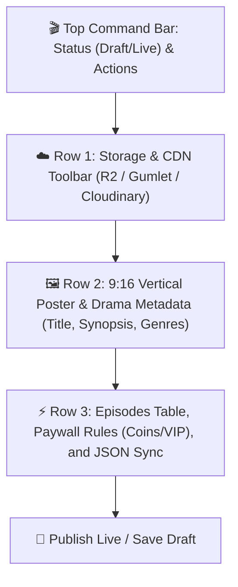

# 🎬 + Add New Drama — ShortTV Drama Studio

The **ShortTV Drama Studio** (`WordPress Admin → ShortTV Hub → + Add New Drama` or `post-new.php?post_type=short_title`) is the vertical video management console designed specifically for ReelShort, DramaBox, and TikTok-style episodic mini-series.

It provides direct integration with **Cloudflare R2**, **Gumlet Video**, and **Cloudinary**, allowing 1-click bulk episode uploading, automatic subfolder routing, live 9:16 poster previewing, flexible coin/VIP paywall rules, and JSON schema syncing.

---

## 📍 Where to Find
- **WordPress Admin**: Go to **ShortTV Hub → + Add New Drama**
- **Direct URL**: `wp-admin/post-new.php?post_type=short_title`

---

## 🧭 Studio Architecture & Workflow



---

## 🚀 1. Top Action & Command Bar

The sticky header bar at the top provides quick status feedback and publishing controls:

| Control | Description |
|---|---|
| **🟡 Status Badge** | Displays current post status (`Draft Mode` vs `Published Live`). |
| **🏷️ Drama ID** | Unique database ID assigned to the series (e.g. `ID #327`). |
| **▶ View Live Watch Page** | Opens the live 9:16 vertical ReelShort web player for testing playback. |
| **💾 Save Draft** | Saves changes without making the drama visible on public feeds. |
| **🚀 Publish Drama** | Deploys the drama live to homepage shelves, search, and API feeds. |

---

## ☁️ 2. Row 1: Storage & CDN Toolbar

ShortTV features native multi-cloud storage orchestration with zero code required:

### Storage Provider Tabs

| Provider | Color Badge | Best For |
|---|---|---|
| **Cloudflare R2** | `🟠 Orange` | Direct high-speed streaming with zero egress fees (S3-compatible). |
| **Gumlet Video** | `🟣 Purple` | Automated HLS transcoding, DRM security, and adaptive bitrate delivery. |
| **Cloudinary** | `🔵 Blue` | Cloud media transformations and global CDN delivery. |

### Quick Actions & Folder Controls

- **⬆️ Bulk Upload Videos**: Select and upload 50 to 100+ episode files simultaneously (`.mp4`, `.mov`, `.mkv`, `.m3u8`).
- **🔢 Auto-Sort by Ep #**: Automatically detects episode numbers in filenames (e.g. `ep01.mp4`, `ep02.mp4`) and re-orders rows ascending.
- **📁 Folder Picker Dropdown**: Visual tree dropdown showing remote cloud buckets and directories.
- **🔄 Refresh**: Fetches newly created folders from the cloud provider API.
- **➕ New Folder**: Creates a new folder on the remote storage bucket.
- **☑ Auto Subfolder**: Automatically routes uploaded files into a subfolder matching the drama title.

> [!IMPORTANT]
> **Crucial Rule: Set Drama Title First!**
> Always type the **Drama Title** *before* clicking Bulk Upload. This guarantees the automatic subfolder generator creates and routes your video files into their own isolated folder in Cloudflare R2 / Gumlet.

---

## 🎨 3. Row 2: Poster (9:16) & Drama Metadata

A balanced two-column layout for visual artwork and streaming metadata:

### Left Column: 9:16 Vertical Poster
- **Dropzone Area**: Drag and drop poster artwork (`.webp`, `.jpg`, `.png`).
- **Upload Progress Bar**: Visual progress indicator during file upload.
- **Source Options**:
  - `Upload`: Upload image directly from your local computer.
  - `Media`: Select from existing WordPress Media Library assets.
  - `Image URL`: Paste direct external CDN or HTTPS image link.

### Right Column: Drama Details & Information
- **🎬 Drama Title (*Required)**: Main title displayed across cards, banners, and watch player.
- **📖 Storyline Synopsis / Overview**: Engaging storyline summary or cliffhanger hook.
- **🏷️ Genres (comma separated)**: Mood and category tags (e.g. `Billionaire, Romance, CEO, Sweet Revenge`).
- **🌐 Language**: Audio/subtitle language (e.g. `English`, `Mandarin`, `Spanish`).
- **Release Year**: Year of premiere (default `2026`).
- **Total Episodes**: Total planned episode count (e.g. `60` or `100`).

---

## ⚡ 4. Row 3: Episodes & Stream Configuration

### Bulk Access & Pricing Rule Presets

Apply monetization and paywall rules across the entire drama in 1 click using the preset selector:

| Rule Preset | Mode Key | Strategy & Behavior |
|---|---|---|
| **🪙 First 5 Free, next Coins** *(Recommended)* | `coins_5free` | Ep 1–5 are completely free to hook viewers; Ep 6 onwards requires coins to unlock. |
| **👑 All Episodes VIP** | `vip_all` | All episodes locked exclusively for VIP / Monthly subscribers. |
| **🟢 All Episodes Free** | `free_all` | 100% free streaming for all users with no coins or login required. |
| **🪙 All Episodes Coins** | `coins_all` | Every single episode requires coins to unlock. |

### Batch Format Tools

- **`⚡ Apply to All`**: Instantly updates all episode rows to match the selected pricing rule.
- **`⚡ Convert MP4 to HLS`**: Converts `.mp4` URLs to `.m3u8` adaptive streaming playlists.
- **`🎬 Use Direct MP4 (.mp4)`**: Resets streams to direct MP4 links for Cloudflare R2 direct playback.
- **`🔢 Auto-Renumber (1 to N)`**: Cleans up and re-sequences episode numbers sequentially.
- **`➕ Add Episode Row`**: Manually appends a single episode row.

---

## 📋 5. JSON Schema Import & Live Sync

Expand the **⚡ Exact JSON Schema Import & Live Sync** drawer to inspect, export, or import entire drama datasets:

```json
{
    "media_id": "short_327",
    "type": "short_series",
    "title": "A Marriage Deal with the Billionaire",
    "slug": "a-marriage-deal-with-the-billionaire",
    "is_published": true,
    "release_year": 2026,
    "total_episodes": 60,
    "language": "English",
    "genres": ["Billionaire", "Romance", "Revenge"],
    "overview": "When her family betrayed her, she married the most ruthless billionaire...",
    "cover_assets": {
        "vertical_poster": "https://cdn.example.com/posters/drama_327.webp",
        "horizontal_banner": "https://cdn.example.com/banners/drama_327.webp"
    },
    "analytics": {
        "view_count": 1420000,
        "like_count": 89000,
        "bookmark_count": 12500
    },
    "episodes": [
        {
            "episode_number": 1,
            "title": "Episode 1: The Unexpected Proposal",
            "stream_url": "https://cdn.example.com/episodes/ep1.mp4",
            "access_type": "free",
            "coins_required": 0
        },
        {
            "episode_number": 6,
            "title": "Episode 6: The Secret Unveiled",
            "stream_url": "https://cdn.example.com/episodes/ep6.mp4",
            "access_type": "coins",
            "coins_required": 10
        }
    ]
}
```

- **`📋 Copy JSON`**: Copies the entire drama schema to your clipboard.
- **`⚡ Sync Form from JSON`**: Parses pasted JSON and instantly populates the form, posters, and all episode stream rows.
