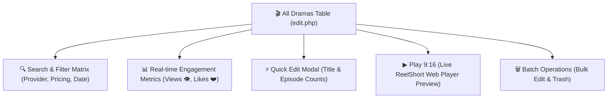
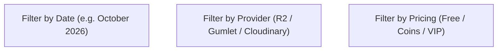

# 🎬 All Dramas — Catalog Management & Analytics

The **All Dramas** console (`WordPress Admin → ShortTV Hub → 🎬 All Dramas` or `edit.php?post_type=short_title`) is the centralized library management hub for short-form episodic vertical dramas. It provides real-time engagement analytics, storage provider filtering, paywall policy monitoring, inline editing, and instant 9:16 web playback.

---

## 📍 Where to Find
- **WordPress Admin**: Go to **ShortTV Hub → 🎬 All Dramas**
- **Direct URL**: `wp-admin/edit.php?post_type=short_title`

---

## 🧭 Catalog Architecture & Workflow

---

## 📊 Catalog Table Columns & Metrics

Every uploaded series is presented with detailed streaming and metadata indicators:

| Column | Header | Content & Interactive Functions |
|:---:|---|---|
| **1** | `[x]` Checkbox | Row selector for batch status changes and bulk moving to trash. |
| **2** | `🖼️ Poster (9:16)` | High-resolution vertical thumbnail with smooth zoom on hover and direct link to live watch page. |
| **3** | `Drama Title` | Series title with post status (`Draft` vs `Published`) and hover action links (*Edit, Quick Edit, Trash, Preview*). |
| **4** | `Media ID` | Unique API key code (e.g. `short_230`, `short_298`) used for Firebase real-time synchronization and REST routing. |
| **5** | `Storage / CDN` | Color badge displaying active cloud provider (**🟠 Cloudflare R2**, **🟣 Gumlet Video**, or **☁️ Cloudinary**). |
| **6** | `Folder Path` | Remote cloud storage directory path (e.g. `short / From Anvil to Throne`). |
| **7** | `Episodes` | Progress badge displaying published episodes vs total planned count (e.g. `0 / 60 Eps`). |
| **8** | `Pricing / Lock` | Monetization rule pill (`🟢 100% Free`, `🪙 Coins Locked`, or `👑 VIP Only`). |
| **9** | `Views / Likes` | Live viewer engagement counters tracking total streams (`👁️ Views`) and audience favorites (`❤️ Likes`). |
| **10** | `Genres` | Highlighted genre taxonomy pills (*Fantasy, Superpower, Throne, Urban, Billionaire, Romance*). |
| **11** | `Watch Vertical` | Action buttons: **`▶ Play 9:16`** (opens live ReelShort vertical player) and **`⚡ Quick`** (instant quick edit modal). |
| **12** | `Date` | Timestamp of last modification and publication date. |

---

## 🔍 Multi-Filter Matrix

Refine large catalogs with dedicated dropdown filters:

1. **Storage Provider Filter**:
   - `All Providers`
   - `🟠 Cloudflare`
   - `🎬 Gumlet Video`
   - `☁️ Cloudinary`
2. **Pricing & Monetization Filter**:
   - `All Pricing`
   - `🟢 Free Stream`
   - `🪙 Coins Locked`
   - `👑 VIP Only`
3. **Publication Status Tabs**:
   - `All (16)` — Full drama catalog
   - `Drafts (16)` — Works in progress
   - `Trash (10)` — Deleted series
4. **Search Box**: Instant title, synopsis, and metadata keyword search.

---

## ⚡ Quick Edit Tools & Batch Actions

### 1. ⚡ Modal Quick Edit
Clicking the **`⚡ Quick`** button on any row opens a floating popup dialog:
- Edit **Drama Title** instantly.
- Adjust **Total Planned Episodes** count.
- Click **Save Changes** to write to database via AJAX without reloading the entire page.

### 2. ✏️ WordPress Inline Quick Edit
Hovering over the title and clicking **Quick Edit** expands standard WordPress controls:
- Slug / URL permalink modification.
- Publication date and timestamp editing.
- Status toggle (`Published`, `Scheduled`, `Pending Review`, `Draft`).
- Password protection / Private visibility toggle.

### 3. 📦 Bulk Edit & Trash
- **Bulk Edit**: Select multiple dramas via checkboxes $\rightarrow$ change publication status or authors in 1 click.
- **Move to Trash**: Safely delete multiple series simultaneously.
