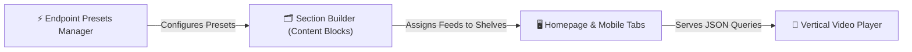
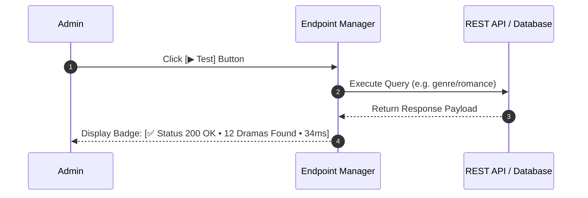

# ⚡ ShortTV Endpoint Presets Manager

The **ShortTV Endpoint Presets Manager** (`WordPress Admin → ShortTV Hub → Endpoint Presets` or `admin.php?page=short-presets`) allows administrators and developers to manage, customize, test, and register query endpoints and automated feeds used in the Section Builder and homepage content shelves.

---

## 📍 Where to Find
- **WordPress Admin**: Go to **ShortTV Hub → Endpoint Presets**
- **Direct URL**: `wp-admin/admin.php?page=short-presets`

---

## 🧭 Architecture & Feed Pipeline

---

## 🛠️ Action Toolbar Controls

The top action toolbar provides quick management and debugging triggers:

| Button | Style | Function & Behavior |
|---|---|---|
| **`➕ Add new row`** | Blue Primary | Appends a new blank endpoint preset row to the table. |
| **`🔄 Reset to defaults`** | Danger Red Outline | Restores all 14 official pre-configured ShortTV query feeds and sorting presets. |
| **`⚡ Endpoint Generator`** | Sky Blue Accent | Launches the interactive modal wizard to generate custom REST API query routes and taxonomy parameters. |
| **`💾 Save configuration`** | Blue Primary | Persists all preset identifiers, labels, and endpoint mappings via AJAX with real-time feedback. |

---

## 📋 Default ShortTV Endpoint Presets

ShortTV comes pre-loaded with **14 optimized query algorithms and genre filters**:

| # | Preset Identifier / Key | Display Name / Label | ShortTV Endpoint / Query Feed | Algorithm / Purpose |
|:---:|---|---|---|---|
| **1** | `shorttv_hero` | 🎬 ShortTV: Hero Slider (Top Featured) | `views` | Highest viewed & curated featured billboard dramas. |
| **2** | `shorttv_leaderboard` | 🏆 ShortTV: Leaderboard & Champions | `rating` | High engagement & top-rated podium leaderboard titles. |
| **3** | `shorttv_popular` | 📈 ShortTV: Most Viewed (Popular) | `views` | Sorts dramas descending by all-time stream view counts. |
| **4** | `shorttv_top_rated` | ⭐ ShortTV: Top Rated (Ranked) | `rating` | Sorts dramas descending by user rating score (e.g. 9.8). |
| **5** | `shorttv_latest` | 🚀 ShortTV: New Releases (Latest) | `latest` | Queries most recently published dramas (`post_date DESC`). |
| **6** | `shorttv_binge` | 🔥 ShortTV: Binge-Ready (Most Episodes) | `episodes` | Prioritizes series with large episode counts (e.g. 60–100+ eps). |
| **7** | `shorttv_vip` | 👑 ShortTV: VIP Only Exclusives | `vip` | Filters dramas gated exclusively by VIP subscription paywalls. |
| **8** | `shorttv_romance` | 💕 ShortTV: Romance & Passion | `genre/romance` | Filters romance, billionaire love, and romantic drama. |
| **9** | `shorttv_fantasy` | ✨ ShortTV: Fantasy & Supernatural | `genre/fantasy` | Filters fantasy, magic, and supernatural drama series. |
| **10** | `shorttv_vampire` | 🦇 ShortTV: Vampire & Werewolf | `genre/vampire` | Filters werewolf, vampire romance, and alpha themes. |
| **11** | `shorttv_ceo` | 👔 ShortTV: Billionaire & CEO | `genre/ceo` | Filters wealthy CEO, contract marriage, and corporate drama. |
| **12** | `shorttv_revenge` | 🗡️ ShortTV: Revenge & Drama | `genre/revenge` | Filters underdog comeback, reborn, and sweet revenge series. |
| **13** | `shorttv_urban` | 🏬 ShortTV: Urban & Modern | `genre/urban` | Filters modern city, family, and slice-of-life drama. |
| **14** | `genre_romance` | ✨ Legends and Myth | `genre/historical` | Filters historical, palace intrigue, and martial arts dramas. |

---

## 🔍 Live Diagnostic Connection Tester

Every preset row includes a **`▶ Test`** button that performs a live execution check:

- **Status Code**: Confirms whether the endpoint returns valid JSON (`200 OK` vs `404 Not Found`).
- **Item Count**: Displays the exact number of matching published drama titles.
- **Latency Diagnostics**: Measures server query execution time in milliseconds.

---

## 🛠️ Step-by-Step: Adding a Custom Feed Preset

1. Click **`➕ Add new row`** in the toolbar.
2. Enter a unique **Preset Identifier / Key** in snake_case (e.g. `shorttv_action_thriller`).
3. Enter a descriptive **Display Name / Label** (e.g. `💥 ShortTV: Action & Thriller`).
4. Set the **ShortTV Endpoint / Query Feed**:
   - For a taxonomy/category: `genre/action` or `genre/thriller`
   - For an internal sorting parameter: `views`, `rating`, `latest`, `episodes`, `vip`
   - For a custom REST route: `api/v1/curated-feed`
5. Click **`▶ Test`** to verify that the query successfully fetches data.
6. Click **`💾 Save configuration`** to register the preset.
7. Go to **ShortTV Hub → Content Blocks** to assign your new preset to any homepage shelf!
