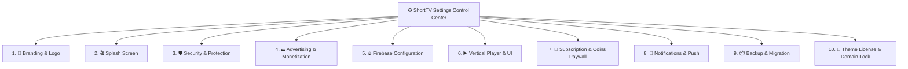

# ⚙️ ShortTV Global Settings Hub

The **Short Stream Settings** control center (`WordPress Admin → ShortTV Hub → Settings` or `admin.php?page=short-settings`) provides 10 modular configuration tabs governing branding, security, monetization, player gestures, Firebase syncing, and licensing.

---

## 🧭 Settings Tabs Navigation Map

---

## 🗂️ Brief & Explicit Summary of All 10 Tabs

| Tab | Direct Guide | Core Purpose & Key Settings |
|:---:|---|---|
| **1** | [🎨 Branding & Logo](branding-and-logo.md) | Site logo upload, `Image Only` vs `Image + Text` display modes, desktop/mobile dimensions (`px`), and 9:16 fallback poster. |
| **2** | [🎬 Splash Screen](splash-screen.md) | App launch animation, pulse/zoom/fade effects, background colors/gradients, and frequency (`Every Visit` vs `Once Per Session`). |
| **3** | [🛡️ Security & Protection](security-and-protection.md) | Right-click disable, DevTools hotkey blocks (F12/Ctrl+Shift+I), debugger traps, iframe clickjacking shield, and console tamper alerts. |
| **4** | [💵 Advertising & Monetization](advertising-and-monetization.md) | Rewarded video ads (earn coins for watching), Google AdSense / Adsterra banner slots, and interstitial interval triggers. |
| **5** | [🔥 Firebase Configuration](firebase-configuration.md) | Multi-device watch history syncing, Google/Phone Auth, Realtime Database credentials, and FCM HTTP v1 push keys. |
| **6** | [▶️ Vertical Player & UI](vertical-player-and-ui.md) | 9:16 video player gestures (swipe up/down for next ep, double-tap to like), autoplay, quality selector, and mobile top bar toggles. |
| **7** | [💎 Subscription & Coins Paywall](subscription-and-coins-paywall.md) | Coin packages store (100 coins = $1.99), VIP weekly/monthly subscriptions, automatic episode unlock thresholds, and payment gateways. |
| **8** | [🔔 Notifications & Push](notifications-and-push.md) | Live web push broadcasting via Firebase Cloud Messaging (FCM v1), scheduled new release alerts, and user opt-in prompt styling. |
| **9** | [📦 Backup & Migration](backup-and-migration.md) | 1-click JSON snapshot exports of all theme settings, layouts, and presets, with instant restore and migration import tools. |
| **10** | [🔐 Theme License & Domain Lock](theme-license-and-domain-lock.md) | License key verification, single-domain lock validation, and direct Telegram support (@ayengcoding). |
