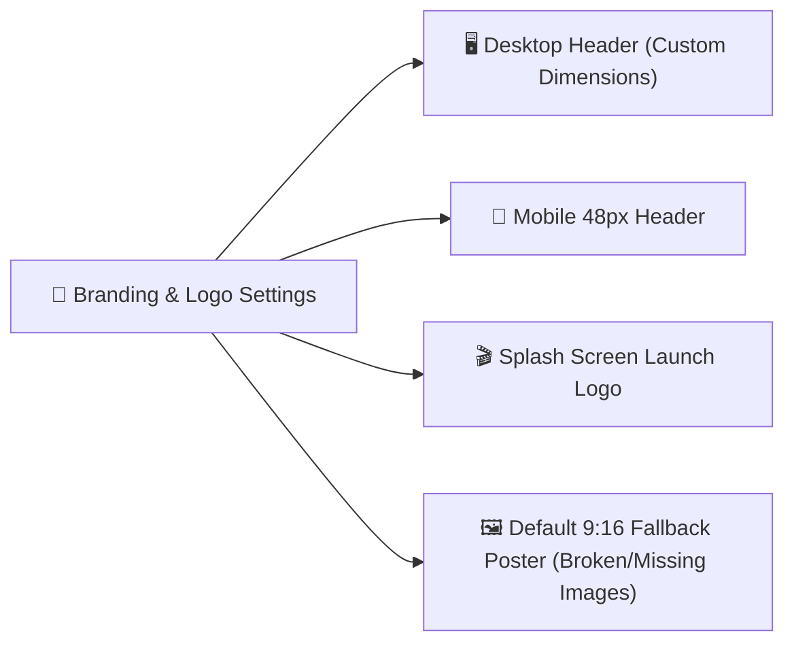

# 🎨 Branding & Logo Settings

The **Branding & Logo** tab (`WordPress Admin → ShortTV Hub → Settings → Branding & Logo` or `?page=short-settings&tab=branding`) manages the site's primary logo assets, desktop/mobile dimensions, brand display mode, and global 9:16 fallback poster.

---

## 📍 Where to Find
- **WordPress Admin**: Go to **ShortTV Hub → Settings → Branding & Logo**
- **Direct URL**: `wp-admin/admin.php?page=short-settings&tab=branding`

---

## 🧭 Architecture & Render Pipeline

---

## 🛠️ Configuration Fields & Options

### 1. 🖼️ Custom Website & App Logo

| Field | Option Key | Recommended Value | Purpose |
|---|---|---|---|
| **Logo URL** | `custom_logo_url` | Transparent `.svg` or `.png` | Primary brand image rendered across headers, splash screens, and navbar. |
| **Logo Display Mode** | `logo_display_mode` | `Image Only` | Choose between **Image Only** (sleek app feel) or **Image Icon + Text** (icon followed by site title). |
| **Brand Display Name** | `brand_name` | `ShortTV` | Used for SEO title tags, PWA manifest, and notification headlines. |

### 2. 📐 Desktop & Mobile Logo Dimensions

| Platform | Height (px) | Width (px) | Notes |
|---|---|---|---|
| **💻 Desktop Logo** | `15px – 150px` (Default: `50px`) | `Auto` or custom `px` | Controls header height on desktop/laptop viewports. |
| **📱 Mobile Logo** | `15px – 100px` (Default: `50px`) | `Auto` or custom `px` | Scaled for the 48px sticky mobile navbar. |

> [!TIP]
> Keep **Width** set to `Auto` so your logo maintains its natural aspect ratio when adjusting the height.

---

## 🎬 3. Default Fallback Drama Poster (9:16 Portrait)

| Field | Option Key | Default Behavior |
|---|---|---|
| **Fallback Image URL** | `fallback_poster_url` | Built-in sleek dark SVG gradient (`fallback-portrait.svg`) |

- **Purpose**: Global placeholder image used across Watch History, Continue Watching, Search feeds, and catalog grids whenever a drama poster is missing, failed to load, or broken.
- **Upload / Reset**: Upload your own branded 9:16 portrait banner (`.webp`/`.png`) or click **Reset to Built-in Default**.
