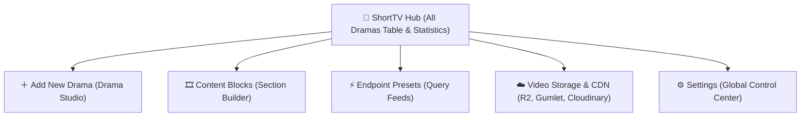

# 📂 ShortTV Hub — Drama Catalog & Statistics

The **ShortTV Hub** (`WordPress Admin → ShortTV Hub` or `edit.php?post_type=short_title`) is the central command table displaying all uploaded short dramas, series metadata, cloud storage destinations, episode counts, live engagement statistics, and batch operations.

---

## 📍 Where to Find
- **WordPress Admin**: Click **ShortTV Hub** (or **ShortTV Hub → All Dramas**)
- **Direct URL**: `wp-admin/edit.php?post_type=short_title`

---

## 🧭 Menu Hierarchy & Structure

---

## 📊 Drama Catalog Table Columns

The table provides a bird's-eye view of your entire short-form streaming catalog:

| Column | Header Name | Content & Functionality |
|---|---|---|
| **Poster** | `🖼️ Poster` | 9:16 vertical thumbnail with hover zoom animation. |
| **Title & ID** | `Drama Title` | Series name with direct link to Drama Studio editor and quick action links (*Edit, Quick Edit, Trash, View*). |
| **Media ID** | `Media ID` | Unique API key identifier (e.g. `short_327`) used for Firebase syncing and REST API queries. |
| **Storage** | `Storage Provider` | Badge showing active CDN provider (**🟠 Cloudflare R2**, **🟣 Gumlet**, or **🔵 Cloudinary**). |
| **Destination** | `Target Folder` | Remote cloud directory (e.g. `short / A-Marriage-Deal...`). |
| **Episodes** | `Total Episodes` | Total published episode count badge (e.g. `60 Eps`). |
| **Paywall Rule** | `Pricing Rule` | Active monetization policy (`🪙 5 Free + Coins`, `👑 VIP All`, `🟢 Free All`). |
| **Statistics** | `📊 Analytics` | Real-time engagement counters: **Views** 👁️, **Likes** ❤️, and **Bookmarks** 🔖. |
| **Genres** | `Genres` | Category pills (*Billionaire, Romance, Revenge*). |
| **Watch Preview** | `▶ Watch` | Direct link to test the drama live in the 9:16 vertical ReelShort web player. |

---

## ⚡ Quick Actions & Tools

### 1. ⚡ Quick Edit Modal
Hovering over any drama and clicking **Quick Edit** opens an instant popup modal allowing you to update the **Drama Title** and **Total Episodes Count** without reloading the page.

### 2. 🔍 Filters & Catalog Search
- **Search Bar**: Search dramas by keyword, actor, or subtitle phrase.
- **Genre Filter Dropdown**: Filter catalog by specific mood/genre taxonomy.
- **Storage Provider Filter**: Filter titles by Cloudflare R2, Gumlet, or Cloudinary.
- **Date / Status Filter**: Filter by All, Published, Drafts, or Trash.

### 3. 🗑️ Bulk Actions
- Bulk Move to Trash
- Bulk Publish / Draft Status Toggle
