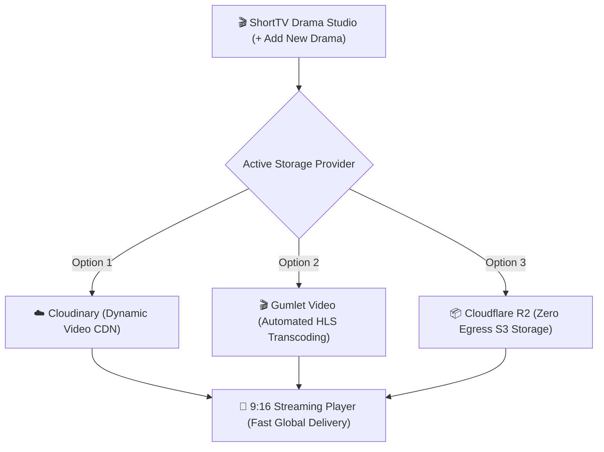
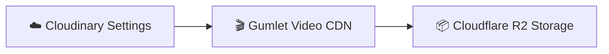

# ☁️ Video Storage & Streaming CDN

The **Video Storage & Streaming CDN** console (`WordPress Admin → ShortTV Hub → Video Storage & CDN` or `admin.php?page=short-video-storage`) manages cloud storage integrations, direct-from-browser video uploading pipelines, automatic transcoding, and global CDN delivery for vertical short dramas.

---

## 📍 Where to Find
- **WordPress Admin**: Go to **ShortTV Hub → Video Storage & CDN**
- **Direct URL**: `wp-admin/admin.php?page=short-video-storage`

---

## 🧭 Multi-Cloud Storage Architecture

---

## 📑 Storage Provider Tabs

Navigate between dedicated provider tabs at the top of the console:

| Provider Tab | Target Service | Key Advantages |
|---|---|---|
| **☁️ Cloudinary Settings** | Cloudinary Media Cloud | Direct-from-browser unsigned uploads, auto-format optimization, global CDN delivery. |
| **🎬 Gumlet Video CDN** | Gumlet Video Infrastructure | Automatic HLS multi-bitrate packaging (`.m3u8`), forensic watermarking, and fast streaming. |
| **📦 Cloudflare R2 Storage** | Cloudflare R2 Object Storage | **Zero egress fees**, ultra-low cost S3-compatible storage, enterprise Anycast edge caching. |

---

## ☁️ 1. Cloudinary Storage Integration

Upload short drama episode videos and vertical 9:16 posters directly to Cloudinary with automatic adaptive streaming.

### Configuration Fields

| Setting Field | Option Name | Example Value | Description |
|---|---|---|---|
| **Cloudinary Cloud Name** | `shorttv_cloudinary_cloud_name` | `ndhpzlga` | Unique Cloud Name found on your Cloudinary dashboard overview. |
| **Upload Preset (Unsigned)** | `shorttv_cloudinary_upload_preset` | `short_preset` | Unsigned upload preset enabling direct browser-to-cloud file uploads. |
| **Default Asset Folder** | `shorttv_cloudinary_folder` | `short` | The base folder where videos and covers will be stored (Default: `short`). |

### ⚡ Step-by-Step Cloudinary Setup Guide:
1. Log in to your [Cloudinary Console](https://cloudinary.com/console).
2. Copy your **Cloud Name** from the main dashboard and paste it into **Cloudinary Cloud Name**.
3. Click the **Settings (Gear Icon)** at the bottom left $\rightarrow$ select the **Upload** tab $\rightarrow$ scroll down to **Upload presets**.
4. Click **Add upload preset**:
   - Set *Signing Mode* to **Unsigned**.
   - Enter a preset name (e.g. `short_preset` or `my_video_preset`).
   - Click **Save**.
5. Paste the preset name into the **Upload Preset (Unsigned)** field in ShortTV.
6. Set the Default Asset Folder to `short`, then click **`Save Cloudinary Settings`**.

---

## 🎬 2. Gumlet Video CDN Integration

Gumlet provides automated video transcoding pipelines that convert uploaded `.mp4` master files into multi-bitrate HLS streams (`.m3u8`).

### Configuration Fields

| Setting Field | Option Name | Example Value | Description |
|---|---|---|---|
| **Gumlet API Key** | `shorttv_gumlet_api_key` | `sec_xxxx...` | Secret API token generated in Gumlet API Management. |
| **Gumlet Source / Collection ID** | `shorttv_gumlet_source_id` | `6ab7548f0b72a4c9158f282a` | Source / Workspace collection ID where video assets are stored. |
| **Streaming Subdomain / CDN** | `shorttv_gumlet_cdn_domain` | `video.gumlet.io` | Custom domain or default Gumlet playback subdomain. |

### ⚡ Step-by-Step Gumlet Setup Guide:
1. Log in to your [Gumlet Dashboard](https://www.gumlet.com/).
2. Create a **Video Source** (select Cloud Storage or Web Folder).
3. Copy the **Source ID** and paste it into **Gumlet Source / Collection ID**.
4. Navigate to **Developer Settings $\rightarrow$ API Keys** $\rightarrow$ generate an API key with Read/Write access.
5. Paste the key into **Gumlet API Key** and click **`Save Gumlet Settings`**.

---

## 📦 3. Cloudflare R2 Storage Integration

Cloudflare R2 provides S3-compatible cloud object storage with **$0 egress fees**, making it the most cost-effective solution for high-traffic streaming platforms.

### Configuration Fields

| Setting Field | Option Name | Example Value | Description |
|---|---|---|---|
| **Cloudflare Account ID** | `shorttv_r2_account_id` | `a1b2c3d4e5f6...` | 32-character account ID located in the Cloudflare dashboard sidebar. |
| **R2 Access Key ID** | `shorttv_r2_access_key` | `24-character Key` | R2 API token Access Key ID with Admin Read & Write permissions. |
| **R2 Secret Access Key** | `shorttv_r2_secret_key` | `64-character Secret` | R2 API token Secret Access Key. |
| **R2 Bucket Name** | `shorttv_r2_bucket` | `short` | Bucket name created for short drama videos. |
| **Public Custom Domain / CDN URL** | `shorttv_r2_public_domain` | `https://cdn.mysite.com` | Custom domain connected to your R2 bucket or `pub-xxxx.r2.dev` URL. |

### ⚡ Step-by-Step Cloudflare R2 Setup Guide:
1. Log in to the [Cloudflare Dashboard](https://dash.cloudflare.com/) and click **R2**.
2. Click **Create bucket** and name it (e.g. `short`).
3. Under **Settings $\rightarrow$ Public access**, connect a custom domain (e.g. `cdn.mysite.com`) or enable the R2.dev public URL.
4. Go to **Manage R2 API Tokens** $\rightarrow$ click **Create API Token**:
   - Permission: **Object Read & Write**.
   - Specify bucket access: All buckets or selected bucket.
5. Copy the **Access Key ID**, **Secret Access Key**, and **Account ID** into the ShortTV R2 settings.
6. Click **`Save R2 Settings`**.

---

## 🔒 Storage Isolation & Security Best Practices

- **Isolated Folders**: Each drama series automatically gets its own isolated folder (e.g., `short/A-Marriage-Deal-with-the-Billionaire/`) to prevent file collisions.
- **Direct-from-Browser Uploads**: Large video files upload straight to Cloudflare R2 or Cloudinary without passing through your WordPress server, preventing PHP upload limit timeouts and saving server RAM.
- **CORS Configuration**: Ensure your Cloudflare R2 bucket has CORS enabled to allow `GET` and `HEAD` from your domain for smooth playback in Safari and mobile browsers.
